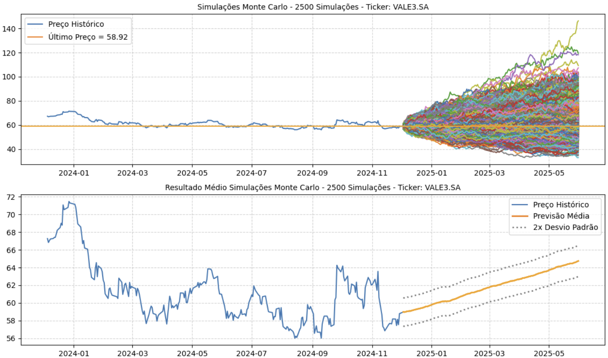
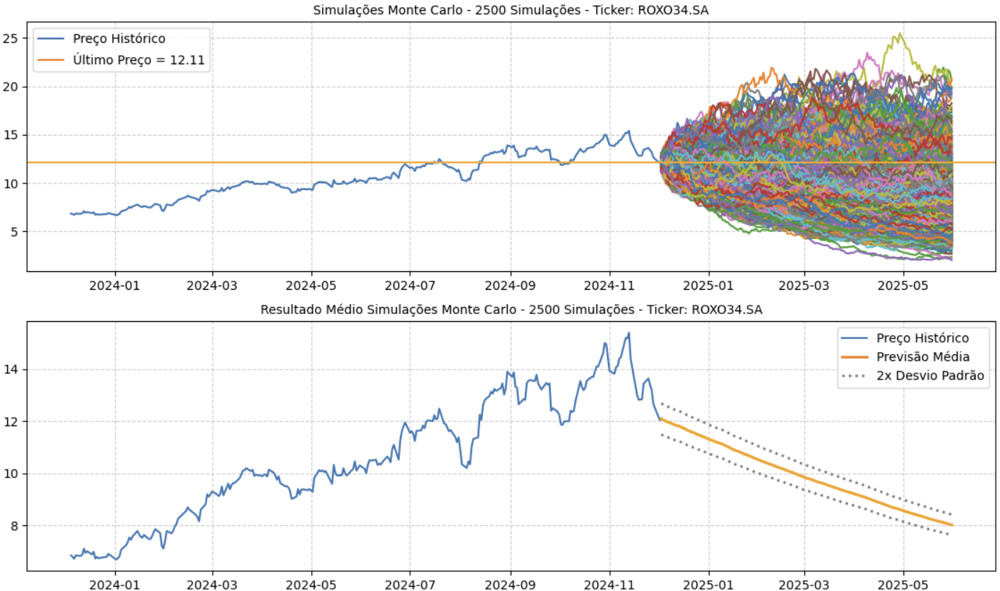
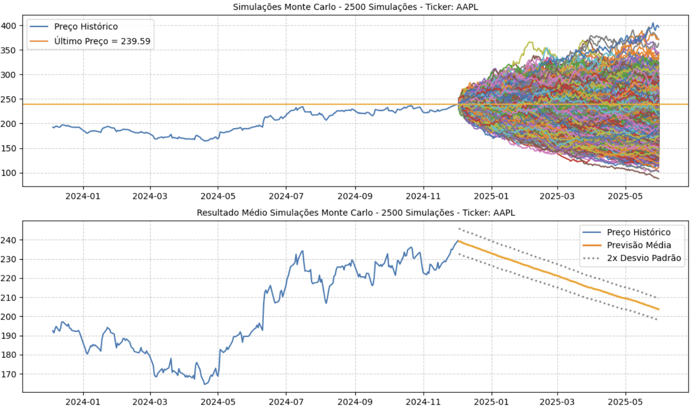

# Ciência de Dados - Projeto Final 7

## Projeto
**Modelo de séries temporais** para previsão do preço de ações em uma casa de análises do mercado financeiro.

## Descrição
O objetivo desse projeto de Ciência de Dados é, a partir dos dados históricos de ações nacionais e internacionais, construir um **modelo de séries temporais** capaz de prever a tendência de alta ou baixa de uma ação para um determinado período de tempo no futuro, para assim poder suportar as recomendações dos analistas de mercado em uma casa de análises do mercado financeiro. Para isso foi realizada uma ampla análise exploratória gerando os principais insights do projeto e permitindo realizar a previsão das tendências das ações. Em seguida, foi criado um modelo para gerar as previsões das ações, permitindo assim embasar as recomendações dos analistas de mercado, aumentando consideravelmente o valor entregue pela empresa aos seus clientes. Isso se reflete em rentabilidades dos ativos que compoem a carteira superiores a média de mercado e a redução considerável na chance dos clientes se frustarem com alguma eventual recomendação que não atingiu o valor esperado.

## Bibliotecas
- **Matplotlib:** https://matplotlib.org/
- **NumPy:** https://pandas.pydata.org/docs/index.html
- **Pandas:** https://pandas.pydata.org/docs/index.html
- **Scikit-Learn:** https://seaborn.pydata.org/
- **Seaborn:** https://seaborn.pydata.org/

## Estrutura do Projeto
- **.venv/:** Pasta destinada a armazenar o ambiente virtual do projeto se necessário
- **data/:** Pasta destinada a armazenar as versões dos datasets: raw, processed, lean, transformed, entre outros
- **deploys/:** Pasta destinada a armazenar os deploys do projeto, em formatos jupyter notebook, python, executável e streamlit
- **dictionaries/:** Pasta destinada a armazenar os dicionários do projeto: charts, data, datasets, evaluation metrics, feature engineering, models, pipeline e stats
- **docs/:** Pasta destinada a armazenar os arquivos e documentos referentes ao projeto
- **functions/:** Pasta destinada a armazenar arquivos com as funções do projeto: charts, libraries e stats
- **images/:** Pasta destinada a armazenar imagens do projeto: illustrations e outputs
- **models/:** Pasta destinada a armazenar os modelos criados durante o projeto
- **notebooks/:** Pasta destinada a armazenar os notebooks de cada etapa do projeto de ciência de dados
- **params/:** Pasta destinada a armazenar as constantes e variáveis globais do projeto
- **presentations/:** Pasta destinada a armazenar as apresentações do projeto, em PowerPoint e PDF
- **references/:** Pasta destinada a armazenar arquivos com informações do projeto, como markdown tables e cronograma
- **reports/:** Pasta destinada a armazenar relatórios criados durante o projeto
- `.env`: Arquivo para armazenar as variáveis de ambiente sensíveis do projeto, como usuários, senhas, tokens e chaves de API
- `.gitattributes`: Arquivo para configurar o repositório e omitir arquivos sem utilidades da versão final do projeto
- `.gitignore`: Arquivo para ignorar determinados arquivos ao subir o projeto para o Github
- `LICENSE`: Arquivo com a licença do projeto
- `README.md`: Arquivo para resumir e apresentar o projeto
- `requirements.txt`: Arquivo para listar as dependências/bibliotecas necessárias no projeto
- `to_do.txt`: Arquivo para anotar as tarefas pendentes do projeto

## Resultados - EDA

